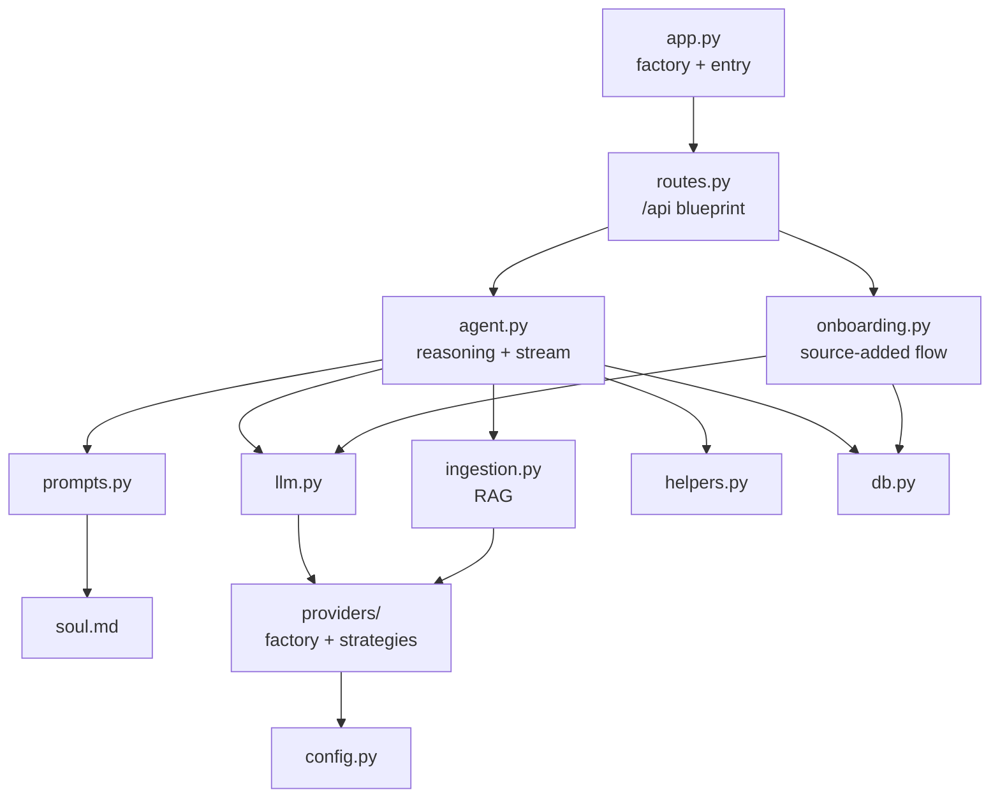
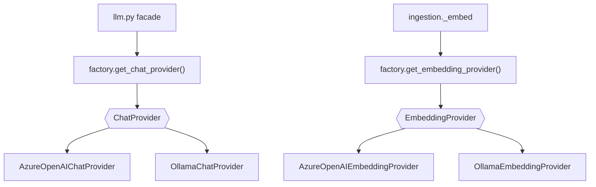
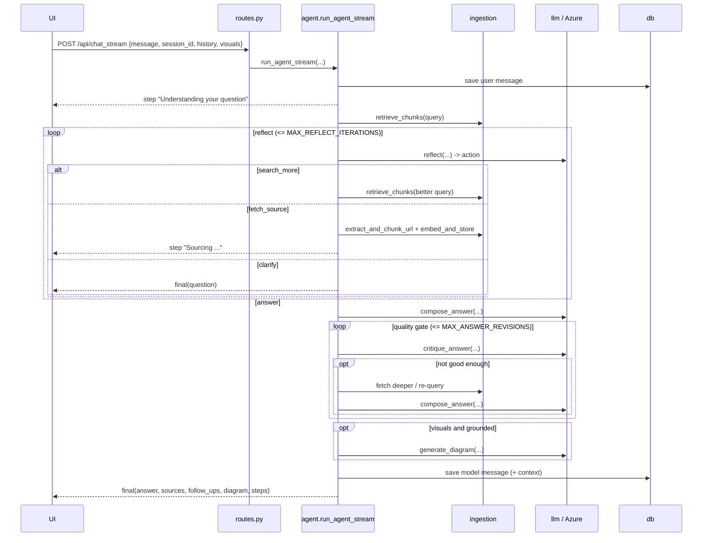
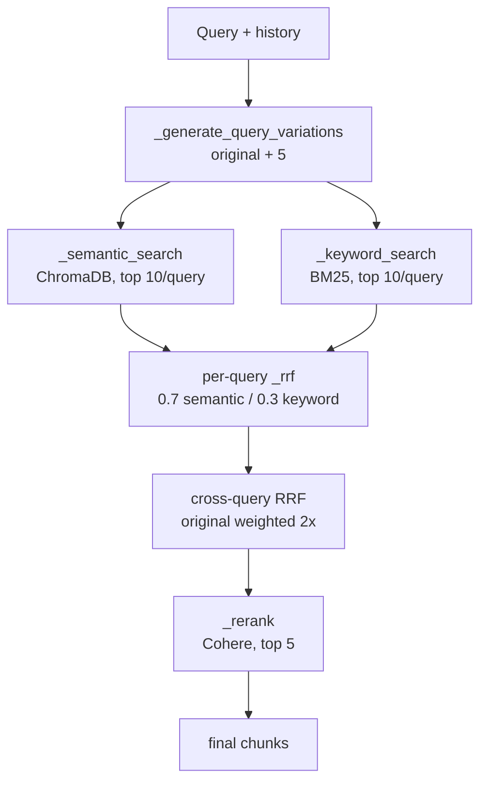

# Backend Low-Level Design (LLD)

Detailed design of the Notebook Flask backend. For the big picture, read the
root [README.md](../README.md) and [DESIGN.md](../DESIGN.md) first.

---

## Module map



Dependencies flow one way (routes → agent/onboarding → ingestion/db/llm →
providers), so no module imports its caller. The only lazy import is
`agent.onboarding_title`, which imports `onboarding` inside the function to
avoid an import cycle.

| Module | Lines of responsibility |
|--------|-------------------------|
| `config.py` | reads `.env`, exposes typed constants (Azure creds, provider selection, Ollama settings, `DOCS_DIR`, `MAX_FILE_SIZE`, `ALLOWED_EXTENSIONS`, loop bounds) |
| `providers/` | pluggable model backends (Strategy + Factory): `ChatProvider`/`EmbeddingProvider` interfaces and Azure/Ollama implementations |
| `llm.py` | thin chat facade — `call_tool()` / `call_text()` delegate to the active `ChatProvider` |
| `prompts.py` | loads `soul.md` as `AGENT_PERSONA`, `render_session_memory()`, and all tool schemas |
| `helpers.py` | pure functions: history→messages, chunk digests/merge, Mermaid cleaning, session-update merge |
| `ingestion.py` | parsing, chunking, embedding (via `EmbeddingProvider`), hybrid retrieval |
| `agent.py` | retrieval, reflection, answer composition, quality gate, `run_agent_stream`; delegates diagrams to the diagram skill |
| `diagram.py` | the diagram skill: decides if a diagram helps, picks the fitting Mermaid type, renders flow-aware Mermaid, applies the semantic colour palette (persona in `diagram_soul.md`) |
| `onboarding.py` | intro / acknowledgement / title generation for added sources |
| `routes.py` | one `/api` blueprint; validation + delegation + JSON/SSE shaping |
| `db.py` | SQLite persistence and migrations |
| `app.py` | `create_app()` factory and `__main__` runner |

---

## Pluggable model providers & confidential mode

Notebook can run its chat and embedding models on different backends without any
change to the agent, onboarding, or retrieval code. This uses two classic
patterns:

- **Strategy** — `providers/base.py` defines two interfaces, `ChatProvider`
  (`call_tool`, `call_text`) and `EmbeddingProvider` (`embed`). Each backend is
  one implementation of these.
- **Factory** — `providers/factory.py` builds and caches providers, and tracks
  the *active* chat + embedding providers for the current request via context
  variables. Callers use `get_chat_provider()` / `get_embedding_provider()` and
  never import a concrete class.



### Confidential mode (per session, locked at creation)

Each session runs in one of two **modes**, chosen once when it's created (a
checkbox in the UI) and never changed:

| Mode | Chat | Embeddings | Guarantee |
|------|------|-----------|-----------|
| **Confidential** | local Ollama | local Ollama | nothing leaves the machine |
| **Standard** | Azure OpenAI | Azure OpenAI | public cloud |

The mode is stored on the session (`sessions.confidential`). On every request
that touches a session, `routes._activate_session_providers` reads that flag and
calls `factory.activate_for_session(confidential)`, which sets the active chat
model **and** embedding provider. Because the backend always derives the
providers from the session's stored flag — never from client input — the lock is
**enforced server-side**: a confidential session can never be pushed to the cloud.

Since embeddings must be local too for confidentiality, and a ChromaDB
collection has a fixed vector dimension, each embedding provider gets its **own
collection**: Azure keeps `documents` (1536-dim); Ollama uses `documents_ollama`
(768-dim). `ingestion._get_collection()` picks the right one from the active
embedding provider, so confidential and standard sessions never share vectors.

**Structured output on local models:** local models don't reliably support
OpenAI-style *forced* tool calls, so `OllamaChatProvider.call_tool` uses JSON
mode instead — it appends an instruction describing the required fields (derived
from the tool's JSON schema) and requests a single JSON object. This is portable
across local models and needs no function-calling support.

`LLM_PROVIDER` / `EMBEDDING_PROVIDER` in config set the process-wide **default**
mode (used when no session is in play, e.g. the eval harness). Adding a new
backend means writing one class implementing the interfaces and wiring it into
the factory — nothing else changes.

---

## Request lifecycle: `POST /api/chat_stream`

The endpoint returns **Server-Sent Events**. `routes.chat_stream` validates the
body and serializes each event dict from `agent.run_agent_stream(...)` as a
`data: {json}\n\n` frame.



### Event contract

| `type` | Fields | Rendered as |
|--------|--------|-------------|
| `step` | `text` | a line in the collapsible thought trace |
| `sources_added` | `sources[]` | triggers a sidebar refresh |
| `final` | `answer, confidence, sources, follow_ups, suggested_links, diagram, steps, [session_title]` | the message bubble |
| `error` | `text` | an error notice |

---

## `agent.py` internals

### Retrieval
`retrieve_chunks(query, history, session_id)` → `ingestion.advanced_search`
(returns `[]` when there is no session). New chunks are folded in with
`helpers.merge_chunks` (dedup by chunk id).

### Reflection — `reflect(...)`
One `call_tool(REFLECT_TOOL)` decision returning `action ∈ {answer, search_more,
fetch_source, clarify}` plus a first-person `thought` for the trace. Near the
iteration limit the agent is instructed to `answer`. `clarify` ends the turn
with a single question.

### Composition — `compose_answer(...)`
Produces the answer in **two calls** — far more reliable than cramming a long
answer plus rich metadata into one constrained-JSON response (small local models
truncate the answer badly when they must also fill a complex schema):

1. a **free-form markdown answer** (complete and well-formatted), built from
   persona + session memory + a **teaching-example** instruction + **strict
   grounding rules** over the numbered citable context;
2. a small **`ANSWER_META_TOOL`** call for the metadata about that answer —
   `source_indices`, confidence, follow-ups, suggested links, and session-memory
   updates.

Post-processing maps `source_indices` to unique `sources`, validates
`suggested_links` (dropping already-added sources), and normalises confidence to
`[0,1]` (`_normalize_confidence`, since some models return a percentage). Returns
`(structured, session_update)`.

Grounding guard: in a session, an answer with **no cited sources** is normally
replaced by the "not found" message with confidence `0.0`. But if chunks *were*
retrieved and the model gave a substantive answer yet forgot to cite (common on
local models), a **citation safety-net** attributes the top retrieved passages
instead of wrongly reporting "nothing found".

### Quality gate — `critique_answer(...)`
Judges the draft; if weak it can request a deeper source (`fetch_url`) or a
`better_query`, after which the answer is recomposed. Bounded by
`MAX_ANSWER_REVISIONS`. Fetches skip already-owned or previously-failed URLs.

### Diagram skill — `diagram.generate(...)` (see `diagram.py`)
A dedicated, persona-driven skill (`diagram_soul.md`). It reasons in two phases:

1. **Plan** — decide whether a diagram genuinely helps (a *medium* bias tied to
   complexity: draw for flows/architectures/relationships, skip simple/short
   answers) and classify the **visual kind** — `flow` / `architecture` /
   `hierarchy` → `flowchart`, plus `sequence`, `class`, `state`, `entity`,
   `mindmap` → their matching Mermaid types.
2. **Render** — generate the Mermaid, then `_sanitize` (normalise malformed
   `style NODE:::role` → `class NODE role`, strip model-invented colours and
   stray sequence-syntax) and `_looks_renderable` (drop diagrams with known-broken
   constructs so a broken one is never shown). A **semantic colour palette** is
   applied by injecting `classDef`s for node roles (process/decision/store/
   external/terminator/highlight) — the app owns the colours, so the same role is
   always the same colour.

Adaptive by model: **cloud** does plan+render in one structured call and uses the
full type set; **local** splits into two calls and is coerced to the types it
renders reliably (flowchart/sequence), since local models mangle strict
class/state/ER syntax.

---

## `onboarding.py` — reacting to a new source

`announce_new_source(session_id, filename, chunks)`:

- **First source** → `generate_intro` (tiny gist + 3-4 "how can I help?" options
  via `INTRO_TOOL`) and titles the session with `generate_title`.
- **Later source** → `generate_acknowledgement` (1-2 sentences tied to the goal).

No long summaries and no diagrams here — the point is to start the conversation.

---

## `ingestion.py` — the RAG pipeline



| Parameter | Value | Where |
|-----------|-------|-------|
| Query variations | 5 | `_generate_query_variations` |
| Semantic hits / query | 10 | `_semantic_search` |
| BM25 hits / query | 10 | `_keyword_search` |
| RRF `k` | 60 | `_rrf` |
| Intra-query weights | 0.7 / 0.3 | `advanced_search` |
| Final chunks | 5 | `advanced_search(top_n=5)` |

Storage:

- **Files** → `docs/<session_id>/<filename>`
- **Vectors** → ChromaDB collection `documents`, chunk id
  `"<session_id>__<filename>__chunk_<n>"`, metadata
  `{filename, chunk_id, page, session_id}`
- **BM25** → in-memory per session (`_bm25_index[session_id]`), rebuilt on
  upload/delete

Everything filters by `session_id`, so sessions are fully isolated. URLs are
canonicalized by `source_name_for_url` for stable dedup.

---

## `db.py` — persistence

SQLite at `./sessions.db`, initialised by `init_db()` with additive
`ALTER TABLE` migrations (safe to run repeatedly).

### `sessions`
| Column | Type | Notes |
|--------|------|-------|
| `id` | TEXT PK | UUID |
| `user_id` | TEXT | always `"default"` (single-user) |
| `title` | TEXT | default `"New Chat"` |
| `context` | TEXT | JSON session memory (goal, topic, example, covered…) |
| `created_at` / `updated_at` | TEXT | ISO-8601 UTC |

### `messages`
| Column | Type | Notes |
|--------|------|-------|
| `id` | INTEGER PK | autoincrement |
| `session_id` | TEXT FK | → `sessions.id`, `ON DELETE CASCADE` |
| `role` | TEXT | `"user"` or `"model"` |
| `parts` | TEXT | JSON `[{"text": ...}]` |
| `confidence` | REAL | model messages |
| `sources` | TEXT | JSON `[{filename, page, chunk_id}]` |
| `follow_ups` | TEXT | JSON `string[]` |
| `suggested_links` | TEXT | JSON `[{url, title}]` |
| `diagram` | TEXT | JSON `{mermaid, caption}` |
| `steps` | TEXT | JSON `string[]` — the thought trace |
| `created_at` | TEXT | ISO-8601 UTC |

> Role values are `user` / `model` in the DB and API; they are converted to
> `assistant` only when calling the OpenAI API (`helpers.history_to_messages`).

---

## API reference

Base prefix: `/api` (registered as one blueprint in `routes.py`).

| Method & path | Purpose |
|---------------|---------|
| `POST /api/chat_stream` | agentic answer, streamed as SSE |
| `GET /api/sessions` | list sessions (newest first) |
| `POST /api/sessions` | create a session → `201` |
| `GET /api/sessions/<id>` | fetch a session's messages |
| `DELETE /api/sessions/<id>` | delete session + messages + files + vectors |
| `POST /api/upload` | upload a PDF/TXT (`multipart/form-data`) |
| `POST /api/upload_url` | add a public documentation URL |
| `GET /api/docs?session_id=<id>` | list a session's source names |
| `DELETE /api/docs/<filename>?session_id=<id>` | remove one source |

`upload` / `upload_url` respond with the ingest status plus a `summary` — the
assistant's onboarding message for that source.

---

## Configuration & tuning

All in `config.py`:

| Constant | Default | Meaning |
|----------|---------|---------|
| `LLM_PROVIDER` | `azure` | chat backend: `azure` or `ollama` |
| `EMBEDDING_PROVIDER` | `azure` | embedding backend: `azure` or `ollama` |
| `OLLAMA_BASE_URL` | `http://localhost:11434/v1` | Ollama OpenAI-compatible endpoint |
| `OLLAMA_CHAT_MODEL` | `llama3.1` | local chat model (must support the workload) |
| `OLLAMA_EMBEDDING_MODEL` | `nomic-embed-text` | local embedding model |
| `MAX_REFLECT_ITERATIONS` | 3 | reflect actions before the agent must answer |
| `MAX_ANSWER_REVISIONS` | 2 | quality-gate recomposition attempts |
| `MAX_AUTO_IMPORTS` | 2 | cap on self-fetched sources per turn |
| `MAX_FILE_SIZE` | 5 MB | upload limit |
| `ALLOWED_EXTENSIONS` | `{pdf, txt}` | accepted upload types |
| `EVALS_MODE` | `false` | when true, answers include raw contexts for the eval harness |

---

## Running

```bash
python app.py                 # http://127.0.0.1:5000, debug=True, threaded=True
python -m pytest tests/ -v    # tests
```

`threaded=True` is required so SSE streams can run alongside other requests.

## Notes & non-goals

Single-user, open CORS, and debug mode are intentional simplifications for a
local learning project — harden them before any deployment. BM25 indexes are
in-memory and rebuilt on demand, so a restart costs nothing but the first
rebuild.
