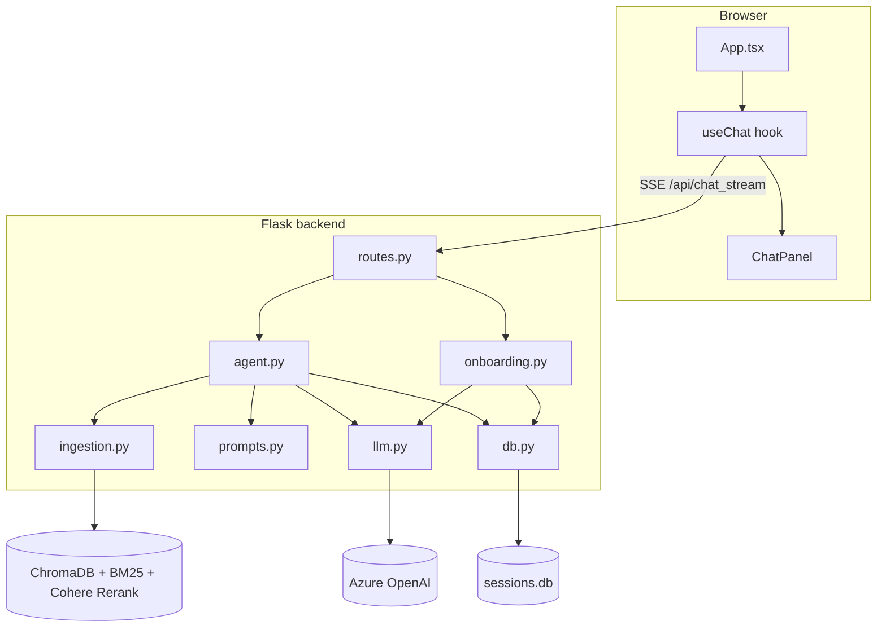
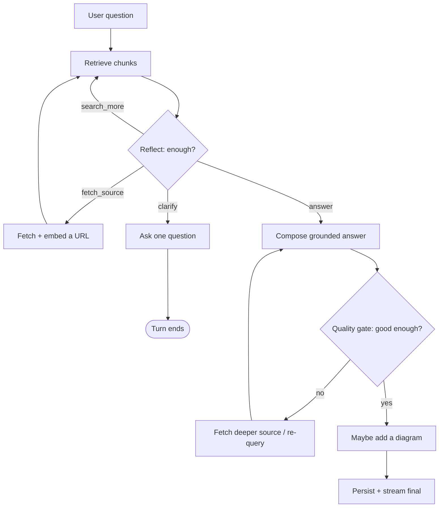
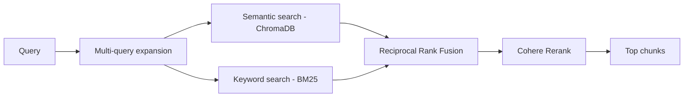

# Design Overview

A lean map of how Notebook is put together and *why*. For endpoint- and
function-level detail, see [ChatBot-Backend/LLD.md](ChatBot-Backend/LLD.md).

---

## 1. The idea

Most document Q&A tools retrieve a passage and paraphrase it. Notebook aims a
little higher: behave like a **tutor** who has read your sources. That means the
system should be able to:

- decide *when it doesn't know enough* and go get more,
- teach with a **consistent, concrete example**,
- show its **working** so the learner trusts (and learns from) the process,
- and reach for a **diagram only when structure matters**.

These goals drive the two defining choices below: an **agent loop** on top of
retrieval, and a **streaming** transport so thinking is visible.

---

## 2. Components

Each backend module has one job:

| Module | Responsibility |
|--------|----------------|
| `routes.py` | HTTP/SSE surface; validates input, delegates, shapes responses |
| `agent.py` | the reasoning loop + streaming orchestrator |
| `onboarding.py` | what the assistant says when a source is added |
| `ingestion.py` | parse → chunk → embed → hybrid retrieve (the RAG pipeline) |
| `prompts.py` | persona (`soul.md`), session-memory rendering, tool schemas |
| `llm.py` | one shared Azure OpenAI client + `call_tool` / `call_text` |
| `helpers.py` | pure, side-effect-free data shaping |
| `config.py` | environment variables and tuning constants |
| `db.py` | SQLite persistence for sessions, messages, and session memory |

---

## 3. The agent loop

A single question is answered in phases, not one call:

- **Reflect loop** (bounded, `MAX_REFLECT_ITERATIONS`): the agent may search
  again, autonomously fetch an authoritative page, or ask for clarification.
- **Quality gate** (bounded, `MAX_ANSWER_REVISIONS`): it critiques its own draft
  and, if shallow, gathers more material and recomposes.
- **Grounding**: answers must cite retrieved chunks; if nothing grounds the
  answer, it says so rather than inventing facts.

Bounds on every loop keep latency and cost predictable.

---

## 4. Streaming (visible thinking)

`/api/chat_stream` is a **Server-Sent Events** endpoint. `agent.run_agent_stream`
is a generator that `yield`s event dicts as it works; `routes.py` serializes them
as SSE frames:

| Event | Meaning |
|-------|---------|
| `step` | a one-line thought for the collapsible trace |
| `sources_added` | the agent fetched new source(s) this turn |
| `final` | the finished answer (text, confidence, sources, follow-ups, diagram) |
| `error` | the turn failed |

The frontend renders `step` events live and collapses them once `final` arrives.

---

## 5. Retrieval (RAG)

Retrieval is deliberately hybrid to balance meaning and exact terms:

Everything is **scoped by `session_id`**, so one session's sources never leak
into another's answers.

---

## 6. Persistence & memory

- **SQLite** (`sessions.db`) stores sessions and messages, including each
  message's confidence, sources, follow-ups, diagram, and thought steps.
- **Session memory** — a JSON `context` blob per session (goal, current topic,
  the running example, what's been covered) that the agent reads and updates
  every turn so it stays consistent across a conversation.
- **Vectors** live in ChromaDB; **BM25** indexes are in-memory and rebuilt on
  demand. Deleting a session removes its messages, files, and vectors together.

---

## 7. Known limitations

Single-user (no auth), open CORS, Flask debug mode, and in-memory BM25 — all
acceptable for a local learning project, all to be hardened before any real
deployment.
