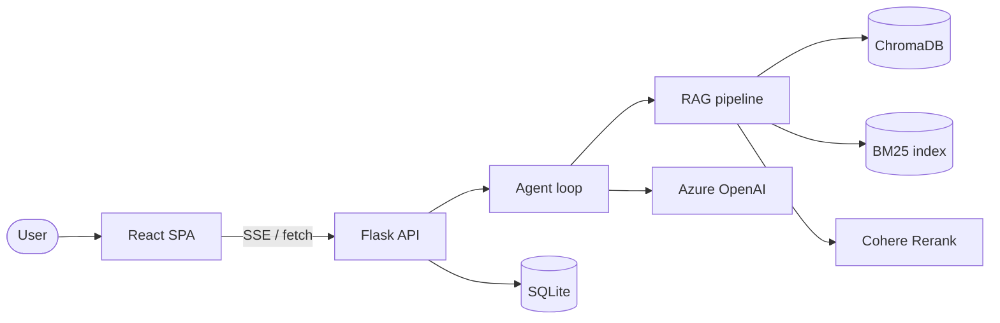

# Notebook

Notebook is an AI **learning companion**. You give it sources — upload a PDF/TXT
or paste a link to public documentation — and then have a conversation to
actually *understand* the material. Instead of answering in one shot, the
assistant works like a patient tutor: it thinks in visible steps, pulls in more
sources when the material is thin, teaches with a consistent running example,
and draws a diagram only when it genuinely helps.

Built with a **React + TypeScript** frontend and a **Python Flask** backend,
powered by **Azure OpenAI** and a hybrid **RAG** (Retrieval-Augmented
Generation) pipeline.

> This is a personal learning project for exploring RAG and agentic patterns.

---

## What it does

- **Bring your own sources** — upload PDF/TXT files or add a public
  documentation URL; each chat session has its own isolated set of sources.
- **Agentic answers** — the assistant reflects before answering: it may search
  again, fetch a more authoritative source on its own, or ask a clarifying
  question, then critiques its own draft and improves it.
- **Visible thinking** — intermediate steps ("Searching again…", "Sourcing
  *Kafka docs*…") stream live as a collapsible thought trace.
- **Teaches, doesn't dump** — grounded answers with a specific running example,
  follow-up suggestions, and a Mermaid diagram only for relationships/architecture.
- **Persistent sessions** — conversations, sources, and session memory are
  stored in SQLite and are fully resumable.

---

## Architecture at a glance



For the reasoning behind this design see **[DESIGN.md](DESIGN.md)**; for the
detailed backend implementation see **[ChatBot-Backend/LLD.md](ChatBot-Backend/LLD.md)**.

---

## Project layout

```
Notebook/
├── README.md                     # this file
├── DESIGN.md                     # lean architecture overview
├── ChatBot-Backend/              # Python Flask API
│   ├── app.py                    # application factory + entry point
│   ├── routes.py                 # HTTP/SSE API (one /api blueprint)
│   ├── agent.py                  # reasoning brain + streaming orchestrator
│   ├── diagram.py               # diagram skill (type selection, palette, rendering)
│   ├── onboarding.py             # reaction when a source is added
│   ├── ingestion.py              # parsing, embedding, hybrid retrieval (RAG)
│   ├── prompts.py                # persona, session memory, tool schemas
│   ├── llm.py                    # chat facade → active provider
│   ├── providers/               # pluggable model backends (Azure, Ollama)
│   ├── helpers.py                # pure data-shaping utilities
│   ├── config.py                 # env vars + constants
│   ├── db.py                     # SQLite persistence
│   ├── soul.md                   # the agent's persona and teaching rules
│   ├── LLD.md                    # backend low-level design
│   └── requirements.txt
└── ChatBot/react-ai-tool/        # React + TypeScript SPA
    └── src/
        ├── App.tsx
        ├── hooks/useChat.ts
        └── components/
            ├── SessionList.tsx
            ├── ChatPanel.tsx
            ├── FileUpload.tsx
            ├── AddSourceMenu.tsx
            ├── MermaidDiagram.tsx
            └── ChatHeader.tsx
```

---

## Prerequisites

| Tool | Version |
|------|---------|
| Python | 3.10+ |
| Node.js | 18+ |
| npm | 9+ |
| Azure OpenAI | deployments for a chat model (e.g. `gpt-4o`) and embeddings (`text-embedding-3-small`) |
| Azure Cohere Rerank | a `cohere-rerank-v4.0-fast` deployment |

---

## Setup

### 1. Backend

```bash
cd ChatBot-Backend

python -m venv venv
venv\Scripts\activate           # Windows
# source venv/bin/activate      # macOS/Linux

pip install -r requirements.txt

# Create a .env file (see the table below). Never commit it.
python app.py                   # serves http://127.0.0.1:5000
```

The first request loads a cross-encoder reranking model, so initial startup
takes a little while.

#### Environment variables (`ChatBot-Backend/.env`)

| Variable | Description |
|----------|-------------|
| `AZURE_OPENAI_API_KEY` | Azure OpenAI service key |
| `AZURE_OPENAI_ENDPOINT` | e.g. `https://<name>.openai.azure.com/` |
| `AZURE_OPENAI_CHAT_API_VERSION` | e.g. `2024-12-01-preview` |
| `AZURE_OPENAI_CHAT_DEPLOYMENT` | chat model deployment name (e.g. `gpt-4o`) |
| `AZURE_OPENAI_EMBEDDING_DEPLOYMENT` | embeddings deployment (e.g. `text-embedding-3-small`) |
| `AZURE_COHERE_RERANK_ENDPOINT` | Azure-hosted Cohere Rerank endpoint URL |
| `AZURE_COHERE_API_KEY` | API key for Cohere Rerank |

### Confidential mode (local models)

Every chat session picks a **mode** at creation (a checkbox in the UI) that is
then **locked for that session**:

- **Confidential** — chat *and* embeddings run on a local **Ollama** model, so no
  document text or prompt ever leaves your machine. The UI shows a
  *"Confidential · Local models"* badge.
- **Standard** — runs on **Azure OpenAI** (public cloud). The UI shows a
  *"Running on public models"* badge.

The lock is enforced server-side: the backend always picks the provider from the
session's stored mode, never from the client.

**To enable local/confidential mode, install Ollama and pull models:**

```bash
# 1. Install Ollama (https://ollama.com), then:
ollama pull llama3.1            # local chat model
ollama pull nomic-embed-text    # local embedding model

# 2. Start the backend as usual. Create a chat with "Confidential mode"
#    ticked — it will run entirely on the local models.
```

| Variable | Default | Description |
|----------|---------|-------------|
| `LLM_PROVIDER` | `azure` | process-wide default chat backend (`azure`/`ollama`) |
| `EMBEDDING_PROVIDER` | `azure` | process-wide default embedding backend |
| `OLLAMA_BASE_URL` | `http://localhost:11434/v1` | Ollama's OpenAI-compatible endpoint |
| `OLLAMA_CHAT_MODEL` | `llama3.1` | local chat model used by confidential sessions |
| `OLLAMA_EMBEDDING_MODEL` | `nomic-embed-text` | local embedding model used by confidential sessions |

> Confidential and standard sessions keep their vectors in **separate ChromaDB
> collections** (different embedding dimensions), so they never interfere.

### 2. Frontend

```bash
cd ChatBot/react-ai-tool
npm install
npm run dev                     # serves http://localhost:5173
# npm run build                 # production build
```

`.env.development` already points the SPA at `http://127.0.0.1:5000`.

---

## Using it

1. **Add a source** — upload a PDF/TXT or paste a documentation URL. The
   assistant greets you with a short gist and a few things you might want to do.
2. **Ask** — type a question. Watch the thought trace as the agent gathers
   context and, if useful, sources more material on its own.
3. **Learn** — read the grounded answer with its example, open the diagram when
   present, and use the suggested follow-ups to go deeper.
4. **Add more sources mid-chat** — use the "+" in the input to widen the
   knowledge base at any time.
5. **Resume anytime** — pick any past session from the sidebar.

---

## Security notes

- Secrets live only in `ChatBot-Backend/.env`, which is git-ignored. **Never**
  commit real keys.
- The API currently has open CORS, no authentication, and runs Flask in debug
  mode — fine for local learning, **not** for production. Lock these down before
  any public deployment.
